# sana_health_t

This is the technical test provided by Sana Health Technologies.

The technical test consists of implementing a marketplace of products using the public API DummyJSON.

## How to Use It
1. First, [download the APK](https://drive.google.com/file/d/1k-s13QIAaMHXZHiPu6fzq_cj-yuLK2SS/view?usp=sharing).  
2. Then, install it.  
3. Deny Google Play advertisements.  
4. Open the app.  

## Functional Requirements
* Products listed  
* Search by text  
* Category filter  
* Detailed product view  
* State management  
* Fully working CRUD  

> ⚠️ Note: The products that are added by the user are stored only temporarily in the BLoC. Since DummyJSON does not allow adding, deleting, or editing products, all these functionalities are volatile. If the app is closed, everything goes back to the initial state.  

## Technical Requirements
* Stable Flutter version  
* State management  
* Good project structure  
* Best practices  

## Endpoints Used
* `/products`  
* `/search?q=$query`  
* `/$id`  
* `/add`  
* `/categories`  
* `/category/$category`  

## Technical Decisions
For this project, I prioritized functionality over UI, since the deadline was short. I decided to implement BLoC as a state manager because it is easy to read and understand. I only implemented 2 BLoCs: the product one and another to handle the categories.

Also, I created 2 providers: one for the product form and another for the categories. Everything is organized in folders. The main screens are no longer than 200 lines.

## Preview
1. Fetching and listing products from the dummyjson API

  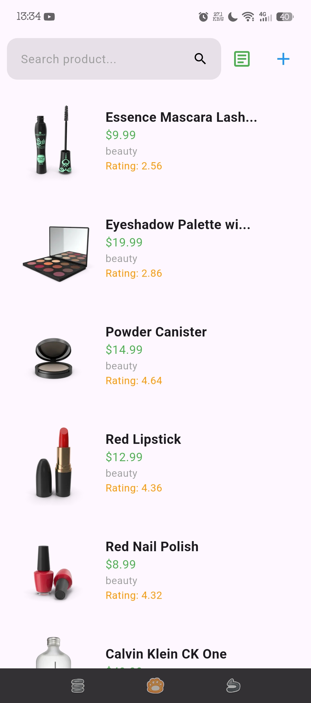

 
3. Searching products by a key word

  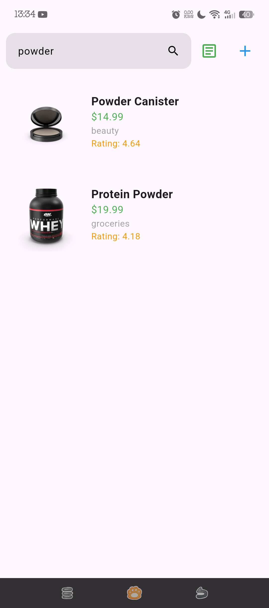

5. These are all the categories that dummyjson API ofrece

  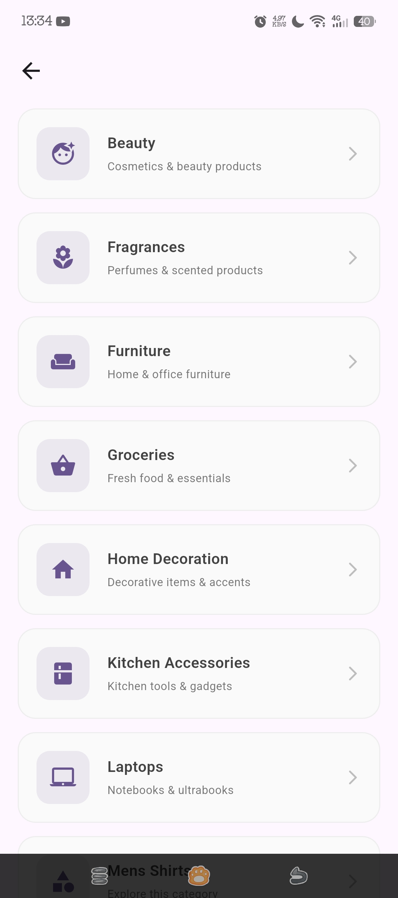
  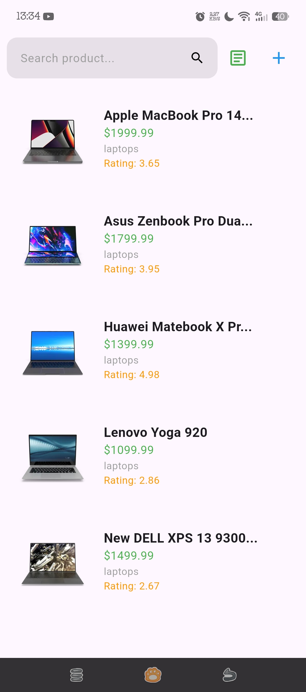

6. Product detail screen

  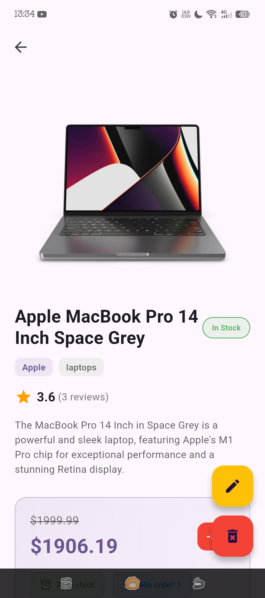
  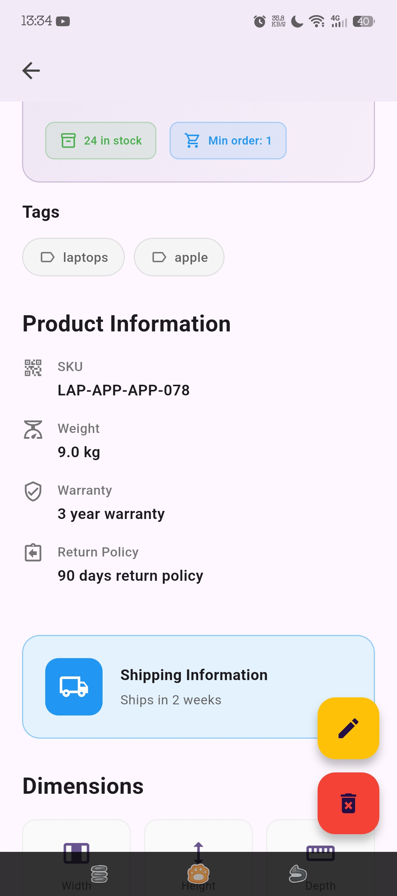
  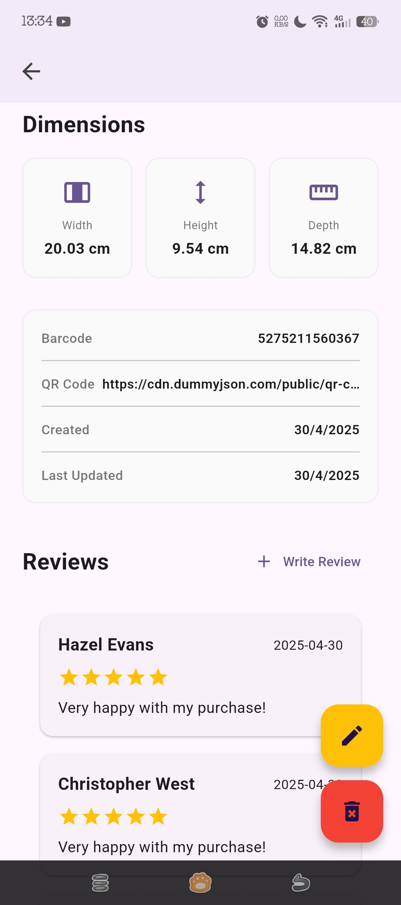

7. Notification before deleting a product

  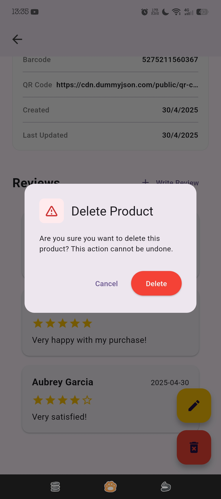

8. Edit a product information

  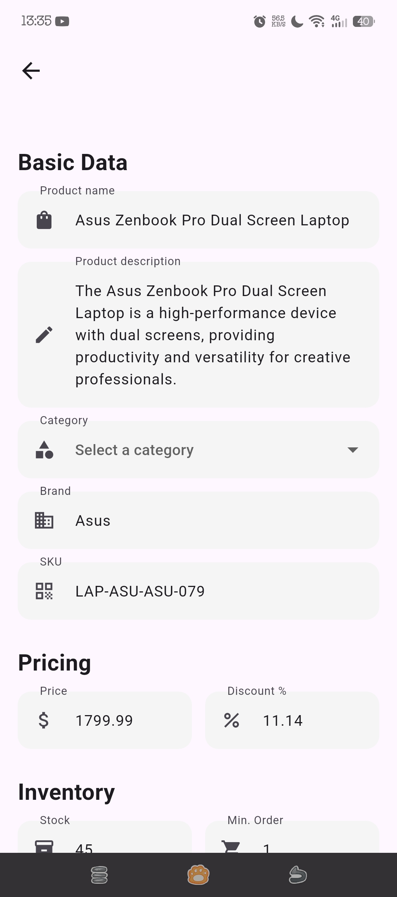
  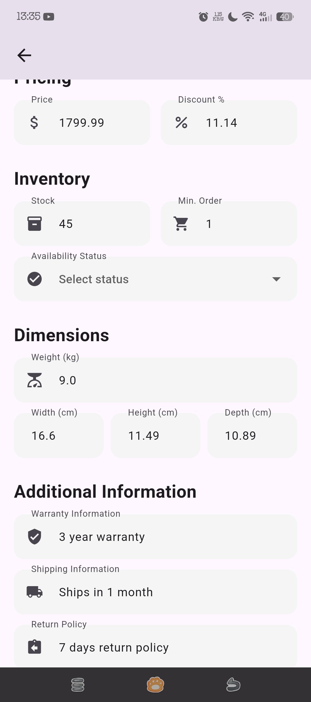
  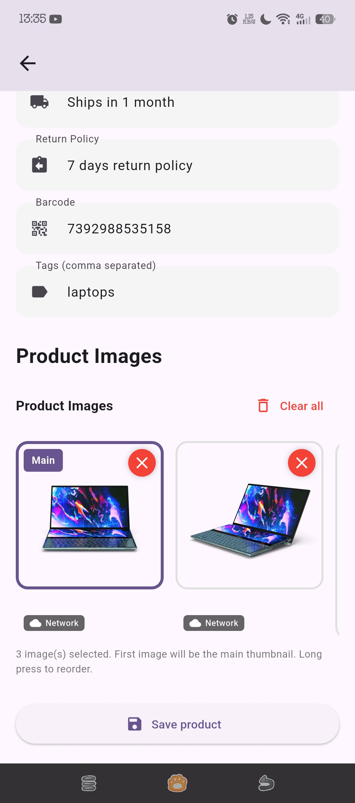

9. Add a new product form

  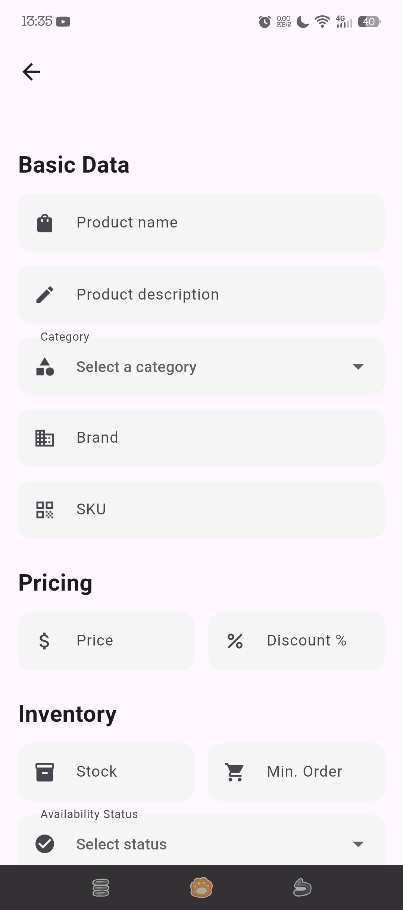
  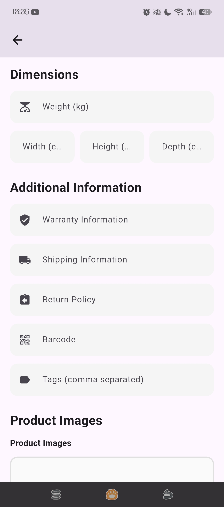
  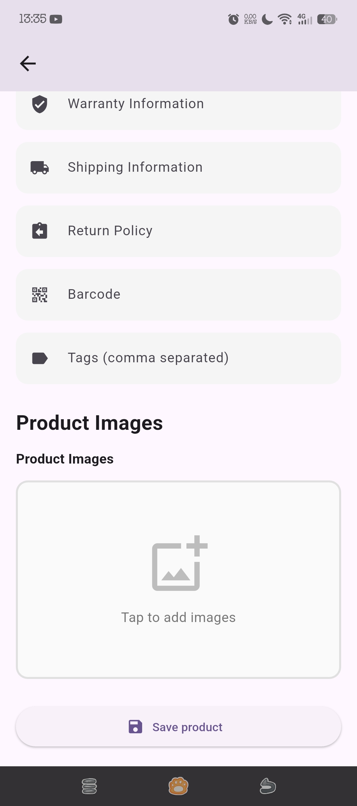

